# 🎬 PhimHay — Modern Movie Explorer App

> *Ứng dụng khám phá phim hiện đại, xây dựng theo chuẩn Production-Ready*

[](https://www.android.com)
[](https://kotlinlang.org)
[](https://developer.android.com/jetpack/compose)
[](https://blog.cleancoder.com/uncle-bob/2012/08/13/the-clean-architecture.html)
[](https://supabase.com)

---

## 📖 Tổng quan / About

**PhimHay** is a full-featured Android application for discovering and exploring movies, built with modern Android development best practices. It demonstrates a production-ready implementation of **Clean Architecture**, **Jetpack Compose**, and **Supabase** backend services.

**PhimHay** là ứng dụng Android đầy đủ tính năng để khám phá phim, được xây dựng theo các thực hành tốt nhất trong phát triển Android hiện đại. Dự án thể hiện việc triển khai **Clean Architecture**, **Jetpack Compose** và dịch vụ backend **Supabase** theo tiêu chuẩn Production.

---

## 🏗️ Kiến trúc / Architecture

Sơ đồ dưới đây thể hiện **luồng dữ liệu một chiều (Unidirectional Data Flow)** của toàn bộ ứng dụng:

```mermaid
graph TD
    subgraph Presentation ["🖥️ Presentation Layer"]
        UI["Jetpack Compose UI\n(Screens & Components)"]
        VM["ViewModel\n(UI State & Events)"]
        UI -- "User Events" --> VM
        VM -- "UI State (StateFlow)" --> UI
    end

    subgraph Domain ["⚙️ Domain Layer (Pure Kotlin)"]
        UC["UseCases\n(Business Logic)"]
        REPO_I["Repository Interfaces"]
        UC --> REPO_I
    end

    subgraph Data ["💾 Data Layer"]
        REPO["Repository\nImplementations"]
        REMOTE["Remote DataSource\n(Retrofit + Supabase)"]
        LOCAL["Local DataSource\n(Room Database)"]
        REPO --> REMOTE
        REPO --> LOCAL
    end

    subgraph Sources ["🌐 Data Sources"]
        TMDB["TMDb API\n(Movie Data)"]
        SUPA["Supabase\n(Auth + Realtime)"]
        ROOM[("Room DB\n⭐ Single Source of Truth")]
    end

    VM -- "calls" --> UC
    UC --> REPO
    REPO_I -.-> REPO
    REMOTE --> TMDB
    REMOTE --> SUPA
    LOCAL --> ROOM
    ROOM -- "offline cache" --> LOCAL

    style Presentation fill:#1a1a2e,stroke:#4285F4
    style Domain fill:#16213e,stroke:#FF4081
    style Data fill:#0f3460,stroke:#3ECF8E
    style Sources fill:#533483,stroke:#7F52FF
    style ROOM fill:#2d6a4f,stroke:#52b788,color:#fff
```



> ⭐ **Room Database** đóng vai trò là **Single Source of Truth** — toàn bộ UI chỉ đọc dữ liệu từ Room, không đọc trực tiếp từ API.

---

## ✨ Tính năng nổi bật / Key Features

| Feature | Mô tả |
|:---|:---|
| 🎬 **Dark Cinematic UI** | Giao diện tối huyền bí, tập trung vào hình ảnh phim |
| 🎨 **Dynamic Color Theme** | Palette API tự trích xuất màu từ poster để đổi màu nền động |
| 🔄 **Shared Element Transition** | Hiệu ứng poster "bay" mượt mà từ danh sách → chi tiết phim |
| 🔍 **Real-time Search** | Tìm kiếm với Debounce + Paging 3, không bị giật lag |
| 🎞️ **Video Player** | Xem phim và Trailer trong app (WebView + Media3/ExoPlayer) |
| 💾 **Offline First** | Xem lại yêu thích & lịch sử kể cả khi mất mạng (Room Cache) |
| 🔐 **Secure Auth** | Đăng nhập/Đăng ký qua Supabase Auth với Row Level Security |
| ✨ **Lottie Animations** | Hiệu ứng loading, empty state và favorite button sinh động |
| 📡 **Real-time Ratings** | Đánh giá/nhận xét phim đồng bộ real-time qua Supabase |
| 🎭 **Cast Details** | Xem thông tin diễn viên và filmography đầy đủ |

---

## 🛠️ Tech Stack

```
📱 UI / Presentation
├── Jetpack Compose      — Declarative UI framework
├── Material Design 3   — Design system
├── Coil                — Async image loading
├── Lottie              — JSON-based animations
└── Palette API         — Dynamic color extraction

⚙️ Architecture & Logic
├── MVVM + Clean Arch   — Separation of concerns
├── Kotlin Coroutines   — Async programming
├── Flow / StateFlow    — Reactive data streams
└── Dagger Hilt         — Dependency injection

🌐 Network
├── Retrofit + OkHttp   — REST API client (TMDb)
└── Kotlinx Serialization — JSON parsing

💾 Storage & Backend
├── Room Database       — Local persistence (offline-first)
├── DataStore           — User preferences
├── Supabase Auth       — Authentication
├── Supabase Postgrest  — Cloud database (Watchlist, Ratings)
└── Supabase Realtime   — Live data updates

🎥 Media
├── Media3 / ExoPlayer  — Video playback
└── WebView             — Embedded movie streaming

📄 Other
├── Paging 3            — Paginated list loading
├── Navigation Compose  — Type-safe navigation + Deep Links
└── Row Level Security  — Database-level security (Supabase)
```

---

## 🔐 Bảo mật / Security

Ứng dụng triển khai **Row Level Security (RLS)** trực tiếp trên Supabase — đảm bảo dữ liệu của mỗi người dùng được bảo vệ ở tầng **server**, không phụ thuộc vào logic phía client:

```sql
-- Mỗi người dùng chỉ thấy dữ liệu của chính mình
CREATE POLICY "favorites_select_policy"
ON favorites FOR SELECT
USING (auth.uid() = user_id);
```

> Ngay cả khi API key bị lộ, kẻ tấn công **không thể** đọc dữ liệu của người dùng khác.

---

## 🚀 Hướng dẫn cài đặt / Setup

### Yêu cầu / Requirements
- Android Studio Ladybug (2024.2.1) hoặc mới hơn
- JDK 17+
- Android SDK 26+

### Các bước / Steps

1. **Clone repository:**
   ```bash
   git clone https://github.com/dungcodedao/PhimHay.git
   cd PhimHay
   ```

2. **Cấu hình API Keys:**

   Tạo file `local.properties` ở thư mục gốc và thêm:
   ```properties
   TMDB_API_KEY=your_tmdb_api_key_here
   SUPABASE_URL=your_supabase_project_url
   SUPABASE_ANON_KEY=your_supabase_anon_key
   ```
   - Lấy TMDb API key tại: [themoviedb.org](https://www.themoviedb.org/settings/api)
   - Lấy Supabase credentials tại: [supabase.com](https://supabase.com/dashboard)

3. **Build & Run:**
   - Mở project trong Android Studio
   - Sync Gradle → Nhấn **Run** ▶️

---

## 📂 Cấu trúc dự án / Project Structure

```
app/src/main/java/com/example/movieapp/
├── 📁 data/
│   ├── local/          # Room Database, DAOs, Entities
│   ├── remote/         # Retrofit API service, DTOs
│   ├── repository/     # Repository implementations
│   └── mapper/         # Data ↔ Domain model mapping
├── 📁 domain/
│   ├── model/          # Domain models (pure Kotlin)
│   ├── repository/     # Repository interfaces
│   └── usecase/        # Business logic use cases
├── 📁 presentation/
│   ├── components/     # Reusable Composables
│   ├── navigation/     # NavGraph, Routes, Shared Transitions
│   ├── pages/          # Screen Composables
│   └── viewmodel/      # ViewModels & UI States
└── 📁 di/              # Hilt dependency injection modules
```

---

## 📮 Liên hệ / Contact

Developed with ❤️ by **Ngô Văn Dũng**

[](https://github.com/dungcodedao)

---

*If you find this project interesting, please give it a ⭐ — it means a lot!*

*Nếu bạn thấy dự án này thú vị, hãy tặng mình 1 ⭐ nhé!*
