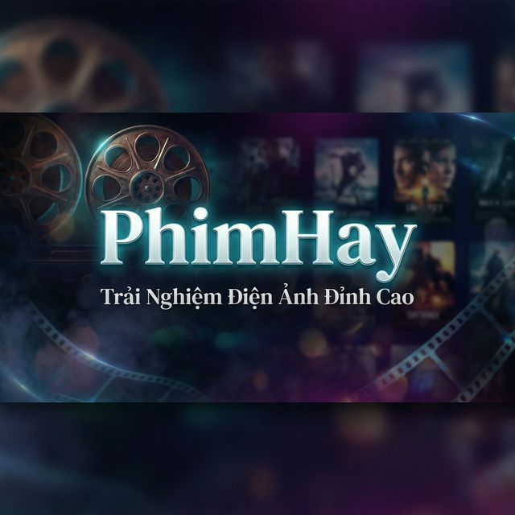
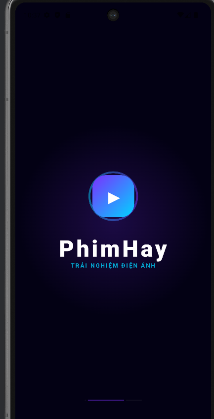
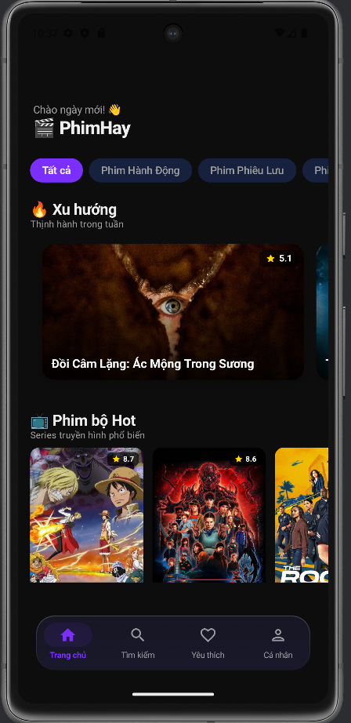
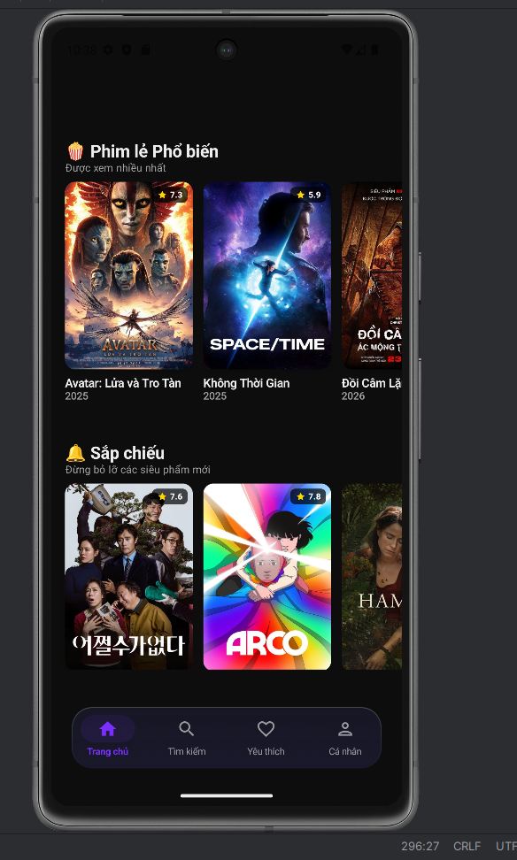
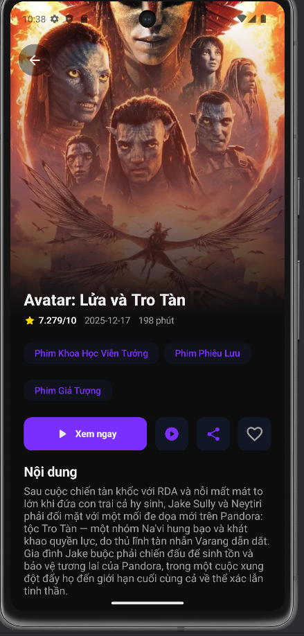
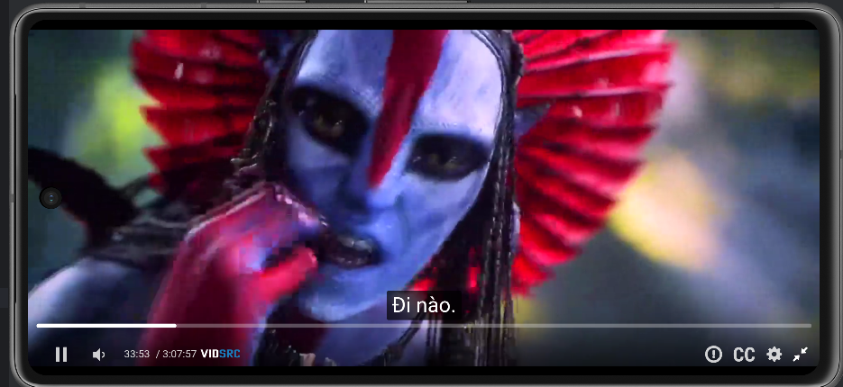

  

# 🎬 PhimHay: Trải Nghiệm Điện Ảnh Cao Cấp

  
  
  

---

## 📊 Trạng Thái Dự Án (Project Status)
**Tiến độ: 95%**
`██████████████████████████████████████░░`

- [x] 🎨 Giao diện Cinematic (Glassmorphism)
- [x] 🔍 Tìm kiếm chuyên nghiệp (Search as you type, History)
- [x] 📺 Trình phát Premium (Ad-block, Multi-server)
- [x] 🔐 Hệ thống tài khoản (Supabase Auth)
- [x] 💖 Quản lý yêu thích & Lịch sử xem
- [ ] 👤 Chi tiết diễn viên (Actor Deep Dive) - *Coming soon*

---

## 📸 Trải Nghiệm Giao Diện (Gallery)

### 🎞️ Giao diện chính và Khởi động

  
  
  

### 📺 Chi tiết phim và Trình phát

  
  

---

## ✨ Tính Năng Nổi Bật

*   **🎥 Cinematic Experience:** Hiệu ứng chuyển cảnh ấn tượng, giao diện Dark Mode cao cấp.
*   **📺 Premium Player:** Hỗ trợ đa server, chặn quảng cáo (Ad-block), tự động xoay ngang.
*   **⚡ Tốc độ cao:** Tải trang tức thì, hỗ trợ 120Hz mượt mà.
*   **🇻🇳 Tiếng Việt:** Việt hóa hoàn chỉnh 100%.

---

## 🚀 Công Nghệ (Tech Stack)

*   **UI:** Jetpack Compose, Material 3, Glassmorphism.
*   **Logic:** Hilt (DI), Coroutines, Room, Retrofit.
*   **Backend:** Supabase Auth & Sync.

---
Phát triển bởi **Ngo Van Dung** (DungCodeDao)
