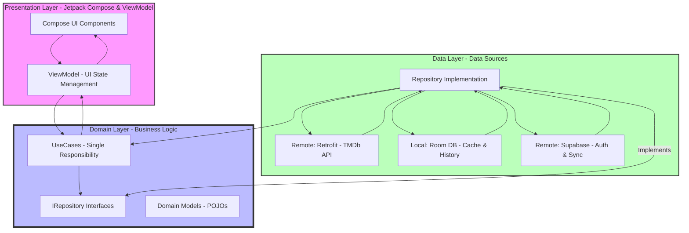

# 📐 MovieApp Architecture

Sơ đồ dưới đây mô tả kiến trúc của ứng dụng, tuân theo mô hình **Clean Architecture** và **MVVM**.

### 🔍 Giải thích chi tiết các thành phần:

1.  **Presentation Layer:**
    *   **Compose UI:** Chịu trách nhiệm hiển thị giao diện người dùng. Không chứa logic nghiệp vụ.
    *   **ViewModel:** Giữ và quản lý trạng thái UI (DetailUiState, HomeUiState...). Giao tiếp với UseCases để lấy dữ liệu.

2.  **Domain Layer (Lớp quan trọng nhất):**
    *   **UseCases:** Mỗi UseCase thực hiện một hành động cụ thể (ví dụ: `GetMovieDetailUseCase`). Giúp code dễ đọc và tái sử dụng.
    *   **IRepository:** Các interface định nghĩa cách thức lấy dữ liệu mà không quan tâm dữ liệu đó lấy từ đâu.

3.  **Data Layer:**
    *   **Repository Implementation:** Nơi ra quyết định lấy dữ liệu từ mạng (API) hay từ bộ nhớ tạm (Cache/Room).
    *   **Retrofit:** Thư viện gọi API TMDb.
    *   **Room:** Cơ sở dữ liệu SQLite cục bộ để hỗ trợ xem offline và lưu lịch sử.
    *   **Supabase:** Xử lý xác thực người dùng và đồng bộ dữ liệu cloud (Đánh giá, Yêu thích).

### 🔄 Luồng dữ liệu (Data Flow):
Ứng dụng tuân thủ luồng dữ liệu một chiều (**Unidirectional Data Flow - UDF**):
1. User tương tác với UI.
2. UI gọi hàm trong ViewModel.
3. ViewModel gọi UseCase.
4. UseCase gọi Repository.
5. Repository lấy dữ liệu từ Data Source thích hợp.
6. Dữ liệu quay ngược lại theo chuỗi và được cập nhật vào State trong ViewModel.
7. UI quan sát State và tự động vẽ lại giao diện.
